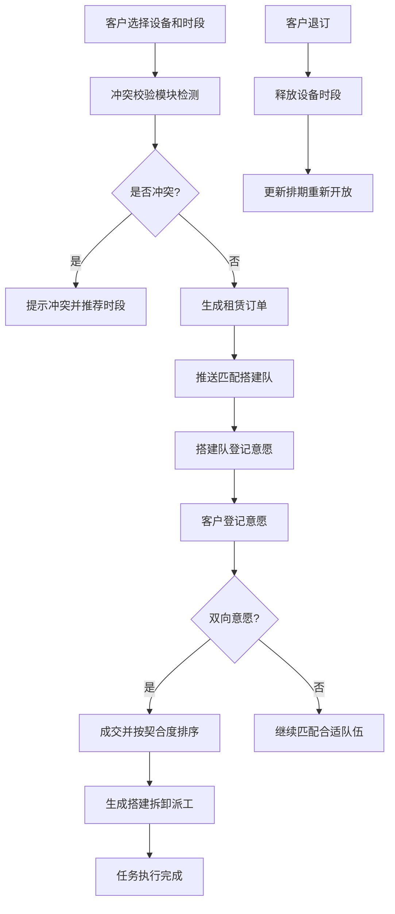

## 1. 产品概述

活动帐篷租赁管理系统，解决帐篷桌椅等设备的时段冲突问题，实现客户与搭建队双向匹配撮合，提升租赁业务效率和匹配精准度。

- **核心价值**：避免设备重复预订冲突，通过双向意愿匹配提升成交率，按契合度智能排序优化资源配置
- **目标用户**：租赁公司管理人员、活动客户、搭建施工队伍
- **市场定位**：专业活动设备租赁管理平台，覆盖从建档到派工的全业务流程

## 2. 核心功能

### 2.1 用户角色

| 角色 | 登录方式 | 核心权限 |
|------|----------|----------|
| 系统管理员 | 账号密码登录 | 设备建档、订单管理、冲突处理、撮合监控、派工管理 |
| 客户 | 账号密码登录 | 设备查询、下单租赁、意愿选择、查看匹配结果 |
| 搭建队 | 账号密码登录 | 查看订单、意愿登记、接收派工、状态反馈 |

### 2.2 功能模块

1. **租赁排期模块**：设备建档、排期日历、订单管理、退订处理
2. **冲突校验模块**：时段重叠检测、冲突预警、退订释放、占用状态管理
3. **双向撮合模块**：意愿登记、互选判定、匹配结果通知、成交确认
4. **契合排序模块**：多维度评分、智能排序、推荐展示、历史匹配记录

### 2.3 页面详情

| 页面名称 | 模块名称 | 功能描述 |
|---------|---------|----------|
| 登录页 | 身份认证 | 角色选择登录、权限校验 |
| 首页仪表盘 | 数据概览 | 订单统计、冲突告警、匹配进度、今日派工 |
| 设备管理页 | 租赁排期 | 帐篷桌椅建档、规格参数、库存管理、设备状态 |
| 排期日历页 | 租赁排期 | 日历视图展示设备占用、时段选择、快速下单 |
| 订单管理页 | 租赁排期 | 订单列表、详情查看、退订处理、状态变更 |
| 冲突检测页 | 冲突校验 | 时段重叠扫描、冲突列表、冲突详情、处理建议 |
| 撮合大厅页 | 双向撮合 | 客户与搭建队互相浏览、意愿登记、匹配状态 |
| 匹配结果页 | 双向撮合 | 互选成功列表、成交确认、历史记录 |
| 契合度排序页 | 契合排序 | 多维度评分展示、智能排序、筛选对比 |
| 派工管理页 | 全流程 | 搭建拆卸任务分配、进度跟踪、状态更新 |

## 3. 核心流程

### 3.1 租赁下单流程
客户浏览设备→选择时段→系统实时冲突校验→无冲突则生成订单→进入撮合环节→有冲突则提示并推荐可选时段

### 3.2 双向撮合流程
订单生成后推送匹配搭建队→搭建队查看订单并登记意愿→客户查看申请搭建队并登记意愿→系统检测双向意愿→互选则成交→单方意愿不成交→按契合度排序展示

### 3.3 退订释放流程
客户发起退订→系统校验订单状态→释放设备时段→更新排期日历→通知相关方→时段重新开放预订

### 3.4 派工执行流程
成交后生成派工单→分配搭建队→执行搭建→验收确认→执行拆卸→工单闭环

## 4. 用户界面设计

### 4.1 设计风格
- **主色调**：深蓝色 #1e40af（专业、可靠）搭配橙黄色 #f59e0b（警示、活力）
- **辅色调**：青绿色 #10b981（成功）、红色 #ef4444（错误/冲突）、灰色 #6b7280（中性）
- **按钮风格**：圆角8px，微立体效果，hover状态有轻微上浮动画
- **字体**：标题使用 "Noto Serif SC" 衬线字体彰显专业感，正文使用 "Inter" 无衬线字体保证可读性
- **布局风格**：侧边导航+主内容区，卡片式模块布局，清晰的信息层级
- **图标风格**：线性图标，统一2px描边，配色与主题色一致

### 4.2 页面设计概览

| 页面名称 | 模块名称 | UI元素 |
|---------|---------|--------|
| 登录页 | 身份认证 | 渐变背景、居中卡片、角色切换Tab、表单动效 |
| 首页仪表盘 | 数据概览 | 数据卡片网格、实时冲突告警横幅、进度环形图、时间线 |
| 排期日历页 | 租赁排期 | 月/周/日视图切换、时间轴、拖拽选时段、冲突红色高亮 |
| 冲突检测页 | 冲突校验 | 冲突列表时间轴、重叠时段可视化、处理操作按钮 |
| 撮合大厅页 | 双向撮合 | 双向卡片布局、意愿滑动按钮、匹配状态徽章 |
| 契合度排序页 | 契合排序 | 评分雷达图、排序切换、对比视图、推荐标签 |
| 派工管理页 | 全流程 | 工单看板、状态流转按钮、进度条、操作日志 |

### 4.3 响应式设计
- **桌面优先**：1920px为基准设计，采用栅格系统自适应
- **平板适配**：侧边栏可收起，卡片自适应换行
- **移动端**：底部Tab导航，单列布局，重点信息前置
- **触控优化**：按钮最小44x44px，滑动手势支持

### 4.4 动效设计
- 页面加载：元素渐入+轻微上移动画，采用staggered延迟错落效果
- 冲突提示：红色边框脉冲动画，吸引注意
- 匹配成功：金色光晕扩散动效，庆祝微交互
- 日历切换：平滑滑动过渡
- 悬停效果：卡片微上浮+阴影加深
