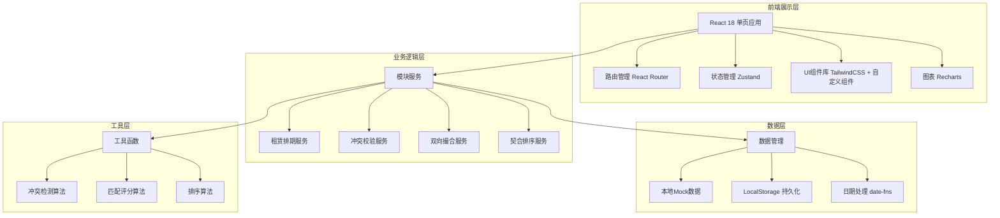
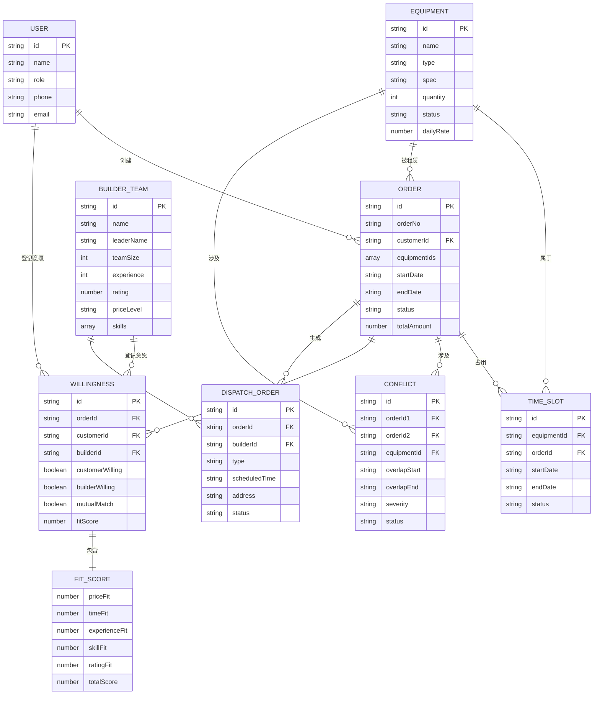

## 1. 架构设计



## 2. 技术说明

- **前端框架**: React@18 + TypeScript
- **构建工具**: Vite@5
- **样式方案**: TailwindCSS@3
- **路由管理**: React Router@6
- **状态管理**: Zustand@4
- **图表库**: Recharts@2
- **日期处理**: date-fns@3
- **图标库**: lucide-react
- **数据持久化**: LocalStorage + Mock数据

## 3. 路由定义

| 路由路径 | 页面名称 | 权限角色 | 说明 |
|---------|---------|---------|------|
| /login | 登录页 | 公开 | 角色选择和身份认证 |
| /dashboard | 首页仪表盘 | 所有 | 数据概览和快捷操作 |
| /equipment | 设备管理页 | 管理员 | 帐篷桌椅建档和库存管理 |
| /calendar | 排期日历页 | 所有 | 设备排期展示和时段选择 |
| /orders | 订单管理页 | 管理员/客户 | 订单列表和详情管理 |
| /conflicts | 冲突检测页 | 管理员 | 时段冲突扫描和处理 |
| /matching | 撮合大厅页 | 客户/搭建队 | 双向意愿登记和匹配 |
| /match-results | 匹配结果页 | 所有 | 互选成功列表和成交确认 |
| /ranking | 契合度排序页 | 所有 | 多维度评分和智能排序 |
| /dispatch | 派工管理页 | 管理员/搭建队 | 搭建拆卸任务管理 |

## 4. 核心类型定义

```typescript
// 设备类型
interface Equipment {
  id: string;
  name: string;
  type: 'tent' | 'table' | 'chair' | 'other';
  spec: string;
  quantity: number;
  status: 'available' | 'occupied' | 'maintenance';
  dailyRate: number;
  description: string;
  createdAt: string;
}

// 时段类型
interface TimeSlot {
  id: string;
  equipmentId: string;
  orderId: string | null;
  startDate: string;
  endDate: string;
  status: 'available' | 'occupied' | 'blocked';
}

// 订单类型
interface Order {
  id: string;
  orderNo: string;
  customerId: string;
  customerName: string;
  equipmentIds: string[];
  startDate: string;
  endDate: string;
  status: 'pending' | 'confirmed' | 'matched' | 'dispatched' | 'completed' | 'cancelled';
  totalAmount: number;
  createdAt: string;
  conflictFlag?: boolean;
}

// 冲突类型
interface Conflict {
  id: string;
  orderId1: string;
  orderId2: string;
  equipmentId: string;
  overlapStart: string;
  overlapEnd: string;
  severity: 'high' | 'medium' | 'low';
  status: 'pending' | 'resolved';
}

// 用户类型
interface User {
  id: string;
  name: string;
  role: 'admin' | 'customer' | 'builder';
  phone: string;
  email: string;
  avatar?: string;
}

// 搭建队类型
interface BuilderTeam {
  id: string;
  name: string;
  leaderName: string;
  phone: string;
  teamSize: number;
  experience: number; // 年数
  rating: number; // 0-5
  priceLevel: 'economy' | 'standard' | 'premium';
  availability: string[]; // 可用日期
  skills: string[];
  completedOrders: number;
}

// 意愿记录类型
interface Willingness {
  id: string;
  orderId: string;
  customerId: string;
  builderId: string;
  customerWilling: boolean | null; // null-未选择, true-愿意, false-不愿意
  builderWilling: boolean | null;
  mutualMatch: boolean;
  fitScore: number;
  createdAt: string;
  updatedAt: string;
}

// 契合度评分维度
interface FitScore {
  priceFit: number;      // 价格契合度 0-100
  timeFit: number;       // 时间契合度 0-100
  experienceFit: number; // 经验契合度 0-100
  skillFit: number;      // 技能契合度 0-100
  ratingFit: number;     // 评价契合度 0-100
  totalScore: number;    // 综合得分 0-100
}

// 派工单类型
interface DispatchOrder {
  id: string;
  orderId: string;
  builderId: string;
  builderName: string;
  type: 'setup' | 'teardown';
  scheduledTime: string;
  address: string;
  status: 'pending' | 'in_progress' | 'completed';
  startedAt?: string;
  completedAt?: string;
  notes?: string;
}
```

## 5. 核心算法

### 5.1 时段冲突检测算法
```typescript
// 检测两个时段是否重叠
function isOverlap(
  start1: Date, end1: Date, 
  start2: Date, end2: Date
): boolean {
  return start1 < end2 && start2 < end1;
}

// 检测新订单与现有订单是否冲突
function checkConflicts(
  newOrder: Order, 
  existingOrders: Order[]
): Conflict[] {
  const conflicts: Conflict[] = [];
  
  for (const equipmentId of newOrder.equipmentIds) {
    const relevantOrders = existingOrders.filter(o => 
      o.equipmentIds.includes(equipmentId) && 
      o.status !== 'cancelled' &&
      o.id !== newOrder.id
    );
    
    for (const existing of relevantOrders) {
      if (isOverlap(
        new Date(newOrder.startDate), new Date(newOrder.endDate),
        new Date(existing.startDate), new Date(existing.endDate)
      )) {
        conflicts.push({
          id: `conflict-${Date.now()}`,
          orderId1: newOrder.id,
          orderId2: existing.id,
          equipmentId,
          overlapStart: new Date(
            Math.max(new Date(newOrder.startDate).getTime(), 
                     new Date(existing.startDate).getTime())
          ).toISOString(),
          overlapEnd: new Date(
            Math.min(new Date(newOrder.endDate).getTime(), 
                     new Date(existing.endDate).getTime())
          ).toISOString(),
          severity: 'high',
          status: 'pending'
        });
      }
    }
  }
  
  return conflicts;
}
```

### 5.2 契合度评分算法
```typescript
function calculateFitScore(
  order: Order, 
  builder: BuilderTeam, 
  customerPreferences: {
    preferredPriceLevel?: string;
    minRating?: number;
    requiredSkills?: string[];
  }
): FitScore {
  // 价格契合度
  const priceWeight = { economy: 100, standard: 75, premium: 50 };
  const preferredPrice = customerPreferences.preferredPriceLevel || 'standard';
  const priceFit = builder.priceLevel === preferredPrice 
    ? 100 
    : priceWeight[builder.priceLevel as keyof typeof priceWeight];
  
  // 时间契合度
  const orderDate = new Date(order.startDate);
  const timeFit = builder.availability.some(d => 
    Math.abs(new Date(d).getTime() - orderDate.getTime()) < 86400000
  ) ? 100 : 60;
  
  // 经验契合度
  const experienceFit = Math.min(builder.experience * 10, 100);
  
  // 技能契合度
  const requiredSkills = customerPreferences.requiredSkills || [];
  const matchedSkills = requiredSkills.filter(s => 
    builder.skills.includes(s)
  ).length;
  const skillFit = requiredSkills.length > 0 
    ? (matchedSkills / requiredSkills.length) * 100 
    : 100;
  
  // 评价契合度
  const minRating = customerPreferences.minRating || 3;
  const ratingFit = builder.rating >= minRating 
    ? 100 
    : (builder.rating / minRating) * 100;
  
  // 综合得分（加权平均）
  const weights = { price: 0.25, time: 0.2, experience: 0.2, skill: 0.2, rating: 0.15 };
  const totalScore = 
    priceFit * weights.price +
    timeFit * weights.time +
    experienceFit * weights.experience +
    skillFit * weights.skill +
    ratingFit * weights.rating;
  
  return {
    priceFit: Math.round(priceFit),
    timeFit: Math.round(timeFit),
    experienceFit: Math.round(experienceFit),
    skillFit: Math.round(skillFit),
    ratingFit: Math.round(ratingFit),
    totalScore: Math.round(totalScore)
  };
}
```

### 5.3 双向匹配判定
```typescript
function checkMutualMatch(willingness: Willingness): boolean {
  return willingness.customerWilling === true && 
         willingness.builderWilling === true;
}
```

## 6. 数据模型ER图



## 7. 项目目录结构

```
src/
├── assets/              # 静态资源
│   └── fonts/           # 字体文件
├── components/          # 通用组件
│   ├── Layout/          # 布局组件
│   ├── ui/              # 基础UI组件(Button, Card, Modal等)
│   ├── Calendar/        # 日历组件
│   └── charts/          # 图表组件
├── pages/               # 页面组件
│   ├── Login.tsx
│   ├── Dashboard.tsx
│   ├── Equipment.tsx
│   ├── Calendar.tsx
│   ├── Orders.tsx
│   ├── Conflicts.tsx
│   ├── Matching.tsx
│   ├── MatchResults.tsx
│   ├── Ranking.tsx
│   └── Dispatch.tsx
├── store/               # 状态管理
│   ├── useAuthStore.ts
│   ├── useEquipmentStore.ts
│   ├── useOrderStore.ts
│   ├── useConflictStore.ts
│   ├── useMatchingStore.ts
│   └── useDispatchStore.ts
├── services/            # 业务服务
│   ├── rentalService.ts     # 租赁排期服务
│   ├── conflictService.ts   # 冲突校验服务
│   ├── matchingService.ts   # 双向撮合服务
│   └── rankingService.ts    # 契合排序服务
├── utils/               # 工具函数
│   ├── conflictDetector.ts  # 冲突检测算法
│   ├── fitScoreCalculator.ts # 契合度评分
│   ├── dateUtils.ts         # 日期处理
│   └── mockData.ts          # Mock数据
├── types/               # TypeScript类型定义
│   └── index.ts
├── hooks/               # 自定义Hooks
│   ├── useConflictCheck.ts
│   └── useMatching.ts
├── App.tsx
├── main.tsx
└── index.css
```
